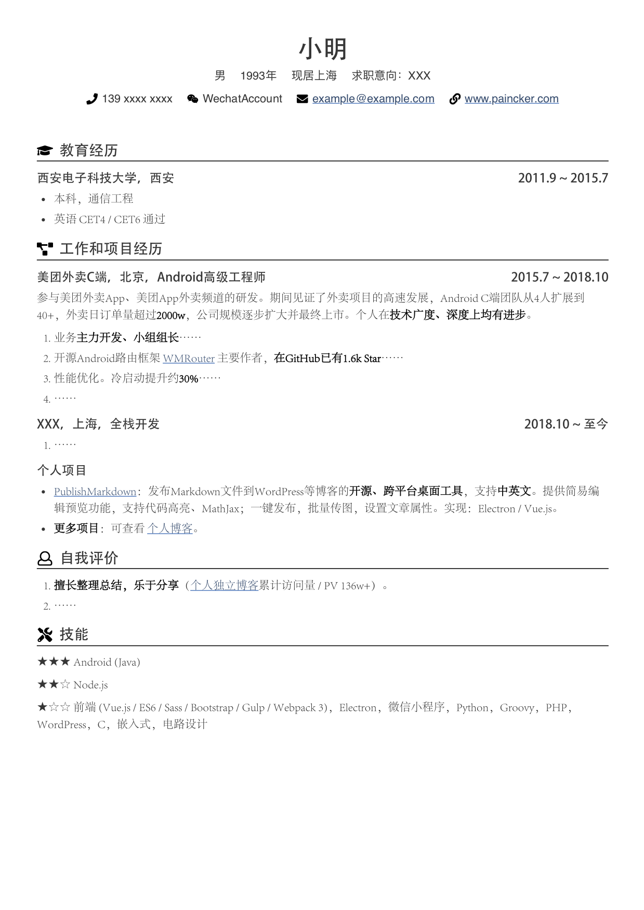
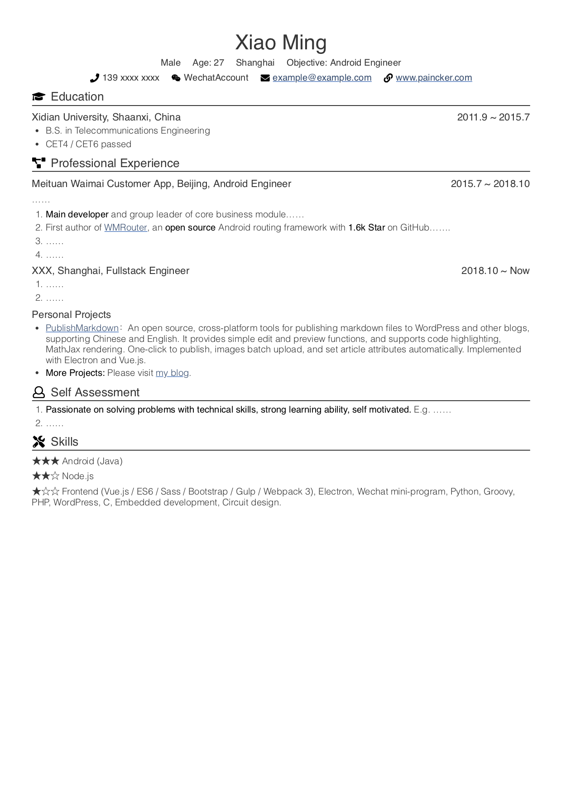
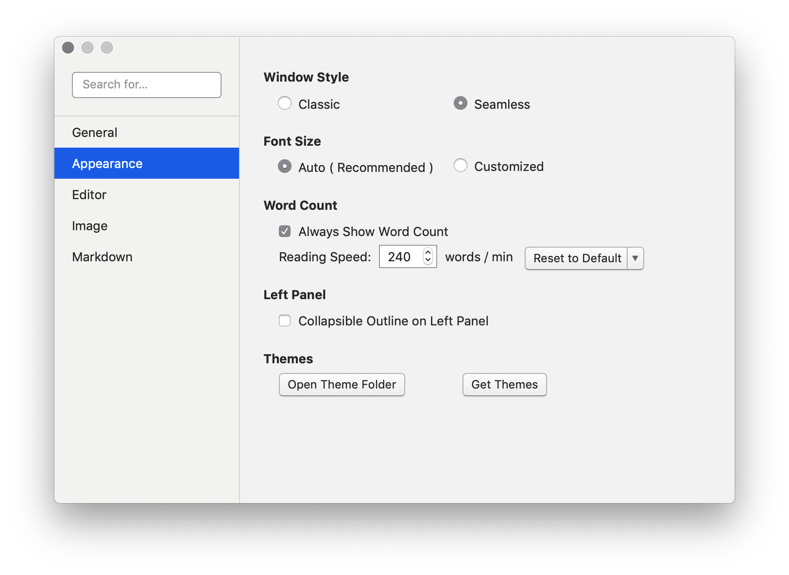
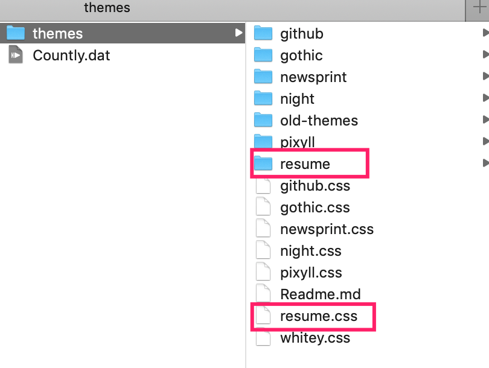
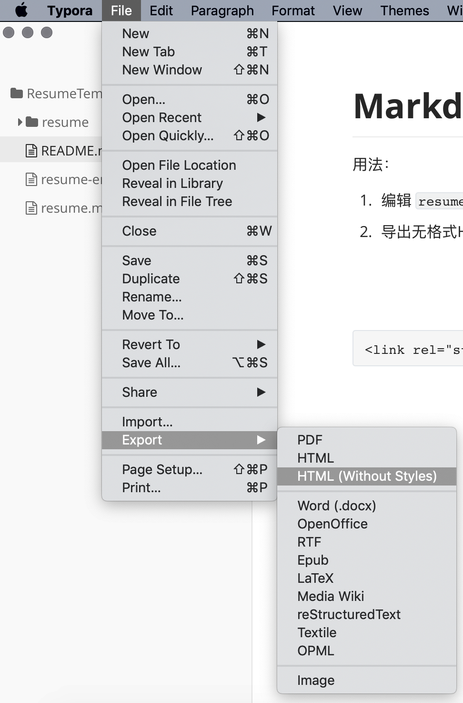
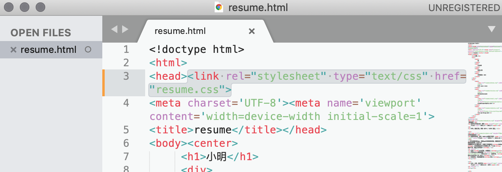
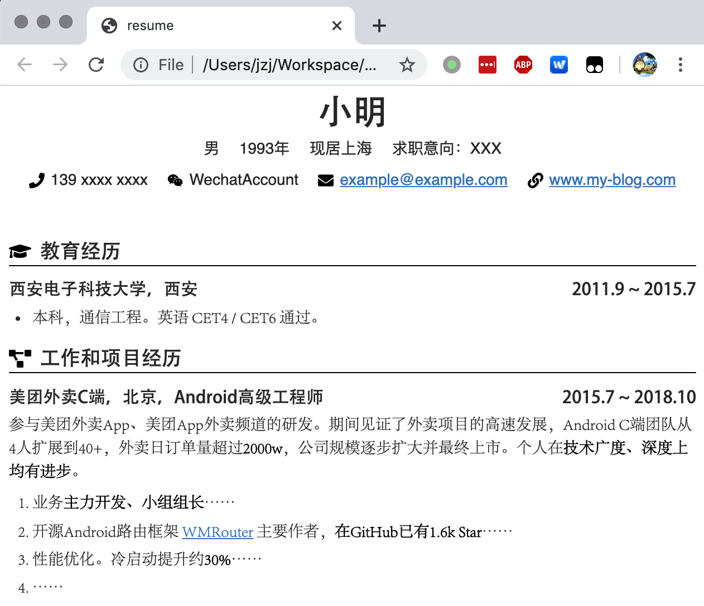
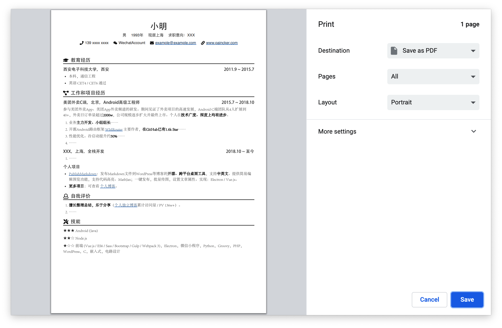

# Markdown简历模板

简易的Markdown中英文简历模板，适合有一定动手能力的人使用。

相关文章：[技术岗位如何写简历](https://www.paincker.com/how-to-write-a-resume)

## 效果展示

生成PDF简历，效果如下。






## 编辑

编辑 `resume.md`（中文简历） 和 `resume-en.md`（英文简历） 文件即可。


## 预览

建议使用Typora编辑。为了方便编辑时预览效果，可以在Typora的设置中打开主题目录（Preferences - Appearance - Themes - Open Theme Folder），将 `resume.css` 和 `resume` 文件夹复制进去。重启Typora，然后在主题菜单中选择 `Resume` 主题即可。





## 导出PDF

直接使用Typora导出PDF文件，页边距会比较大，简历内容较多时，一页能显示的东西太少。因此可以先导出为HTML，再借助Chrome浏览器的打印功能导出PDF。

1、从 `md` 文件导出无格式HTML并保存到相同文件夹。对于Typora，可使用菜单 `File - Export - HTML(Without Styles)`。




2、用文本编辑器打开HTML文件，在 `head` 标签中引入CSS样式，中文简历用 `resume.css`，英文简历用`resume-en.css`。

```html
<link rel="stylesheet" type="text/css" href="resume.css">
```




3、使用Chrome或其他现代浏览器打开HTML文件，查看效果。如有前端开发经验，可以根据需要自行修改CSS样式进行调整。




4、使用Chrome的打印功能，可以输出为PDF。根据打印效果，可以重新调整内容长度，或者调整CSS中的行间距，使其符合页数要求。




## 说明

部分字体、图标等内容来自：

https://github.com/CyC2018/Markdown-Resume

https://github.com/billryan/resume

目录 `icons` 中还有一些其他SVG图标，均来自 [Font Awesome](https://fontawesome.com/)，可以按需选用。

